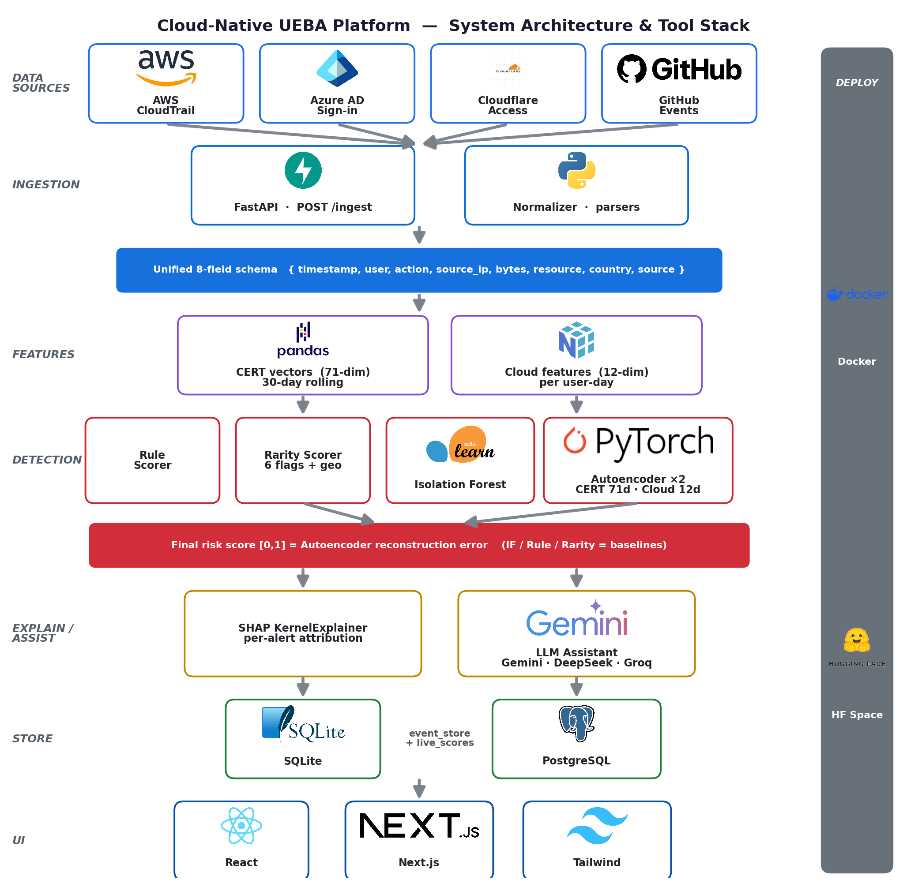
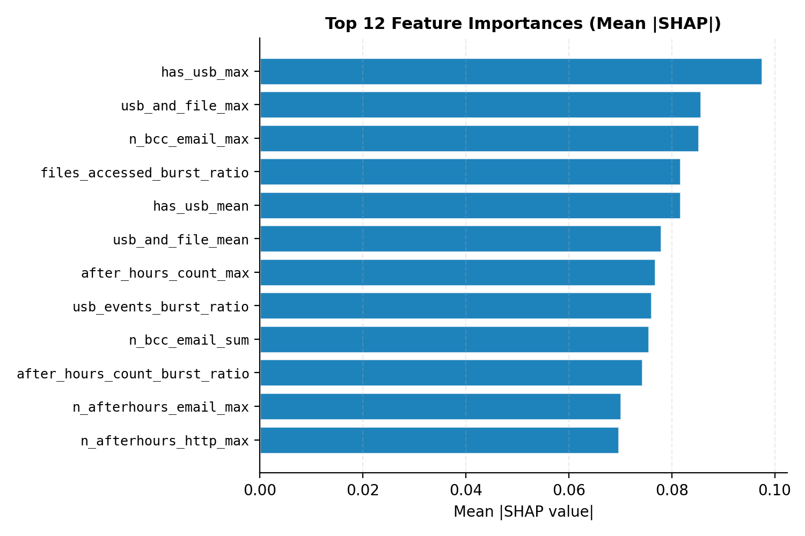
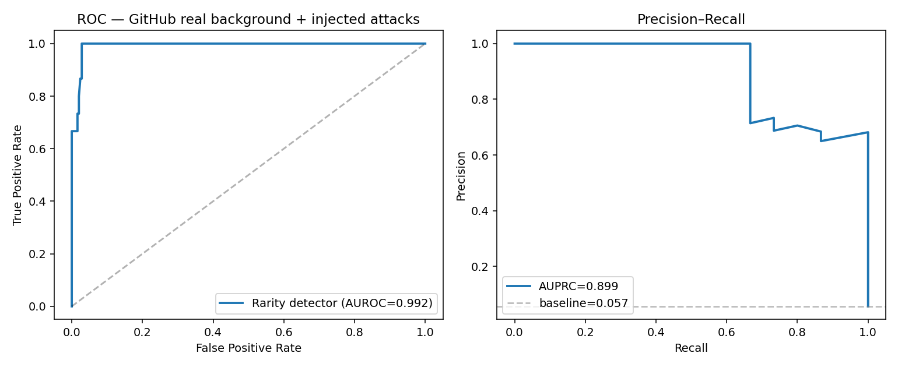
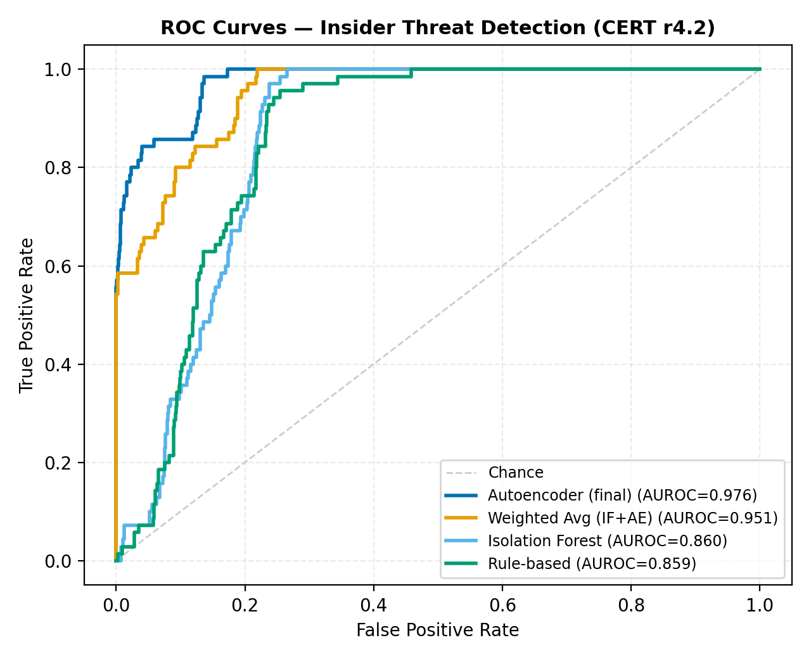
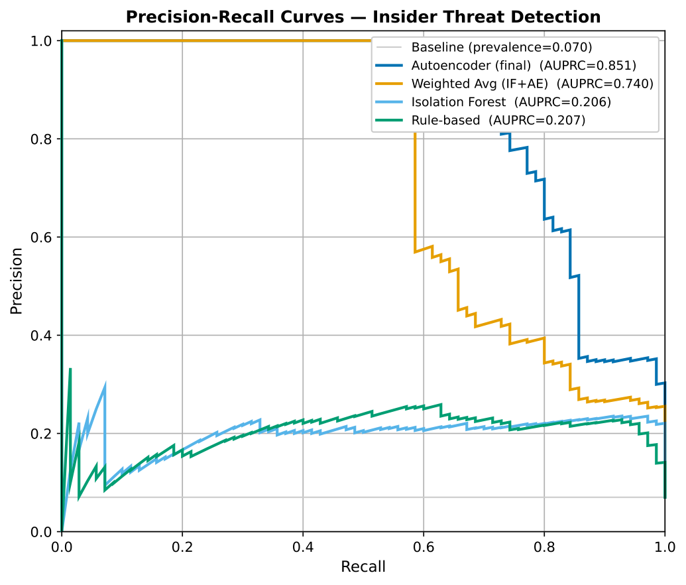
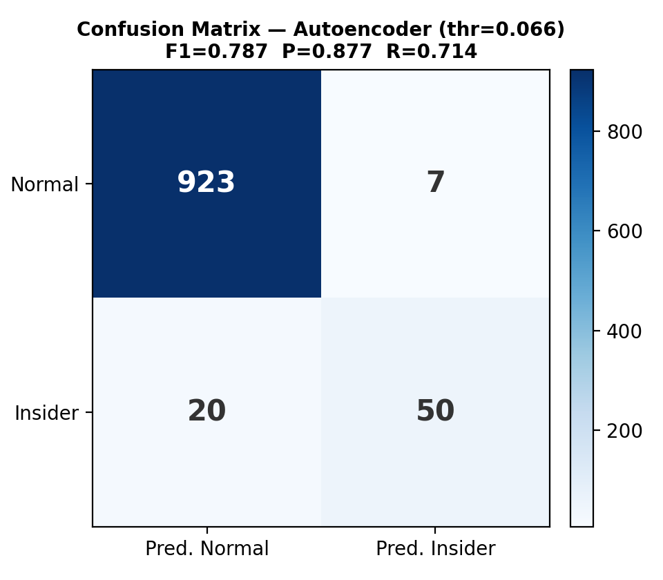
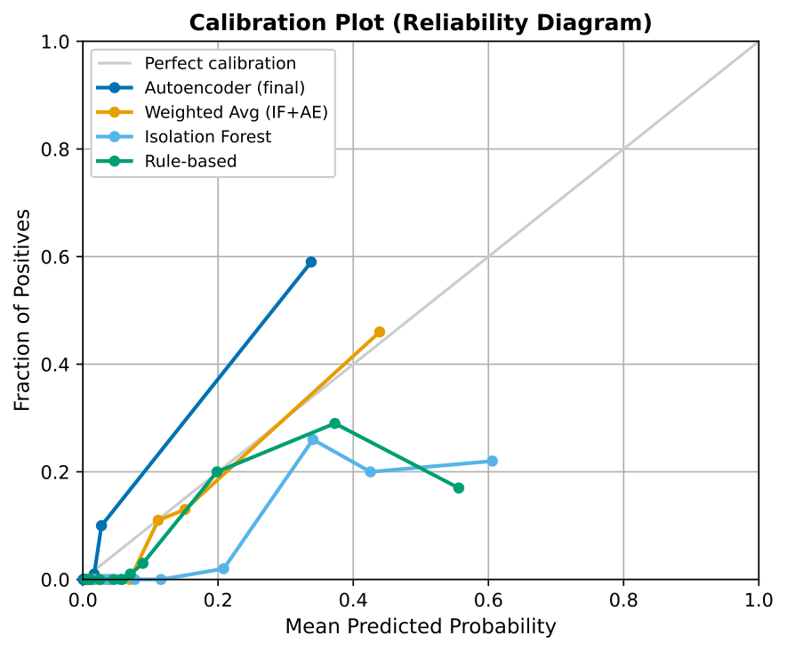
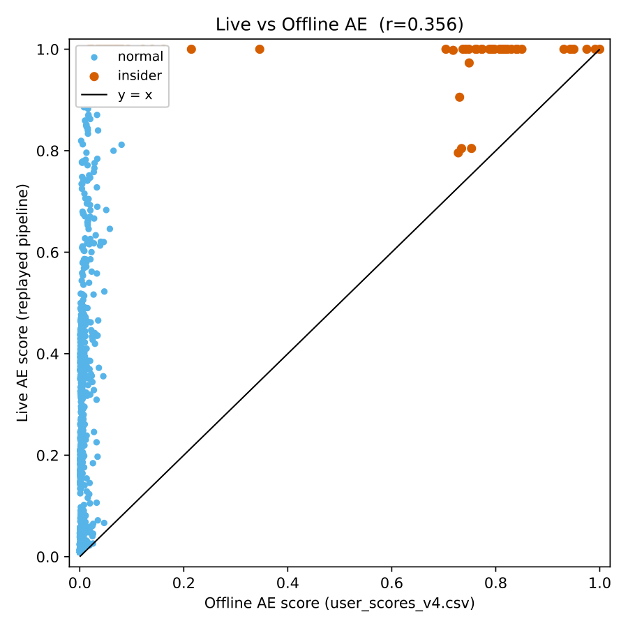

# Argus — Cloud-Native UEBA for Insider-Threat Detection
## Full Technical Report & FYP2 Methodology

**Author:** Z.C. Yap  ·  **Supervisor:** Firdaus Sahran
**Faculty of Computer Science and Information Technology, Universiti Malaya**

> Companion reference for FYP2 preparation and defense. Every figure, formula, file
> and hyperparameter below is taken directly from the implemented codebase, not from
> the earlier draft proposal — so it is safe to quote in the viva.

---

## 1. Executive Summary

Argus is a **cloud-native User and Entity Behaviour Analytics (UEBA) platform** that detects
insider threats, compromised accounts and data exfiltration **without any labelled attack
data**. It ingests activity logs from four cloud/enterprise sources, normalises them into a
single schema, scores each user with a **one-class deep autoencoder** (trained on benign-assumed
data — no attack labels in the objective), explains every alert with **SHAP attribution and an LLM
analyst assistant**, and surfaces results through a full **SOC workflow** (dashboard → alert triage
→ investigation case → resolution).

**Headline results (CERT r4.2, 1,000 users, 70 insiders, label-free):**

| Detector | AUROC | AUPRC | F1 | Precision | Recall |
|---|---|---|---|---|---|
| **Autoencoder (final detector)** | **0.976** | **0.851** | **0.787** | 0.877 | 0.714 |
| Weighted Avg (0.75·AE + 0.25·IF) | 0.951 | 0.740 | 0.726 | 0.954 | 0.586 |
| Isolation Forest | 0.860 | 0.206 | 0.379 | 0.235 | 0.971 |
| Rule-based baseline | 0.859 | 0.207 | 0.367 | 0.259 | 0.629 |

**External validity:** flaws.cloud AWS CloudTrail (real breach data) **AUROC 0.724**;
streaming live-replay through the production `/ingest` endpoint **AUROC 0.917** (vs 0.976 offline).

> *Rigour note:* the 0.976 is a transductive figure; a **5-fold inductive cross-validation
> (held-out users only) gives AUROC 0.959 ± 0.004** (§6.2), confirming the result generalises and is
> not a training-set-overlap artefact.

---

## 2. Datasets

### 2.1 CERT Insider Threat Dataset r4.2 (primary benchmark)
- Source: Carnegie Mellon University / ExactData synthetic enterprise dataset.
- Scale: ~**32 million events**, **1,000 users**, **17 months**, **70 malicious insiders**.
- Five raw log files: `logon.csv`, `device.csv`, `file.csv`, `email.csv`, `http.csv`.
- Ground truth: `is_insider` label per user (used **only for evaluation**, never for training).
- Threat scenarios include data exfiltration via removable media, IP theft, and sabotage.

### 2.2 flaws.cloud AWS CloudTrail (real-world validation)
- Source: Scott Piper's public AWS CTF dataset (~2M real CloudTrail events).
- Used to validate the **cloud autoencoder** on genuine AWS API behaviour.
- Ground-truth labels: `Level5`/`Level6` = privilege-escalation attackers; service/admin
  accounts (`backup`, `AWSService`, `Root`, `flaws`, …) = normal.
- Honest caveat (state this in the viva): the cloud AE is **evaluated on the same dataset's
  attacker sessions it excluded from training** (time-held-out), so 0.724 is a same-dataset
  generalisation check, not a cross-dataset test.

### 2.3 Multi-source data — what is normalised vs evaluated

All four cloud/enterprise sources are **normalised** into the common 8-field schema (parsers
implemented; AWS and Azure unit-tested) and demonstrated live in the Demo Lab. Their evidentiary
status differs, and the distinction matters for examination:

| Source | Real data | How it is used |
|---|---|---|
| **AWS** (flaws.cloud) | ✅ real CloudTrail | **Labelled detection evaluation** — cloud AE, AUROC 0.724 |
| **CERT r4.2** | ✅ labelled benchmark | **Primary labelled detection evaluation** — AUROC 0.976 |
| **GitHub** (public Events API) | ✅ real live activity | **Ingested live** + **semi-synthetic labelled evaluation** (§6.1) |
| **Azure AD** (Splunk attack_data / SimuLand) | ✅ real SignInLogs | **Normalised + ingested**; no labelled detection eval |
| **Cloudflare Access** | ❌ none public | **Normalised**; format-accurate synthetic only |

> **Scope note (important for examination).** Quantitative *detection accuracy* rests on the
> labelled datasets — **CERT r4.2** and **flaws.cloud (AWS)**. **GitHub** real data is ingested
> live and additionally yields a *semi-synthetic* labelled result (real benign background + injected
> ground-truth attacks, §6.1). **Azure** real logs are normalised and ingested but not evaluated
> against labels. **Cloudflare** has no public real dataset. The multi-source claim is therefore a
> strong **normalisation + live-ingestion** contribution, with labelled detection evaluated on AWS,
> CERT, and (semi-synthetically) GitHub.

---

## 3. System Architecture (7-layer pipeline)

```
 ┌─ DATA SOURCES ─────────────────────────────────────────────────────────┐
 │  AWS CloudTrail · Azure AD · Cloudflare Access · GitHub  (+ CERT r4.2)  │
 ├─ INGESTION / NORMALISATION ────────────────────────────────────────────┤
 │  FastAPI POST /ingest → normalizer.py → unified 8-field schema         │
 ├─ FEATURE ENGINEERING ──────────────────────────────────────────────────┤
 │  CERT: 21 base → 71-dim vector   |   Cloud: 12-dim per user-day        │
 │  Peer-group clustering (K-Means, K=8, fit on normals)                  │
 ├─ DETECTION (label-free) ───────────────────────────────────────────────┤
 │  Autoencoder ×2 (CERT 71-d, Cloud 12-d)  ← FINAL detector              │
 │  Baselines: Isolation Forest · Rule scorer · Weighted Avg              │
 │  Rarity scorer: 6 interpretable flags                                  │
 ├─ EXPLAIN / ASSIST ─────────────────────────────────────────────────────┤
 │  SHAP attribution  +  LLM assistant (Gemini · DeepSeek · Groq)         │
 ├─ STORE ────────────────────────────────────────────────────────────────┤
 │  SQLite (dev) / PostgreSQL (prod): events, live_scores, alerts,        │
 │  investigations, cloud_shap                                            │
 ├─ PRESENTATION (SOC workflow) ──────────────────────────────────────────┤
 │  Next.js dashboard → Alerts (triage) → Investigations (case) → resolve │
 └─ DEPLOY: Docker · Hugging Face Spaces (backend) · Vercel (frontend) ───┘
```

{width=5in}

---

## 4. Code File Inventory

### 4.1 Backend (FastAPI, Python) — `backend/`

| File | Lines | Responsibility |
|---|---|---|
| `main.py` | 1122 | FastAPI app; all REST endpoints; orchestrates the `/ingest` pipeline (7 stages), `/users`, `/stats`, alerts, investigations, admin tools. |
| `normalizer.py` | 596 | Parsers for each source (`parse_aws_cloudtrail`, `parse_azure_ad`, `parse_cloudflare_access`, `parse_github`, CERT parsers) → unified 8-field schema. |
| `loader.py` | 566 | Loads scored users from parquet/CSV at startup; computes risk tiers; **peer-group K-Means (K=8)**; serves `get_users`, `get_stats`, peer context. |
| `ae_scorer.py` | 486 | Loads the trained PyTorch autoencoders (CERT 71-d + Cloud 12-d); builds the 71-feature vector; computes live AE reconstruction-error scores. |
| `models.py` | 433 | Pydantic request/response schemas + validators (e.g. valid `source` values, risk levels). |
| `event_store.py` | 394 | Persistence for `events`, `live_scores`, `cloud_shap`; DB-agnostic (SQLite/PostgreSQL). |
| `ai_suggest.py` | 368 | LLM ensemble: calls Gemini 2.5 Flash, DeepSeek, Groq Llama-3.3-70B in parallel, synthesises one investigation plan. **No Anthropic.** |
| `investigations.py` | 333 | Investigation case store: status, analyst, notes, append-only history. |
| `rarity_scorer.py` | 300 | Six source-agnostic rarity flags + rarity score (no training needed). |
| `alert_store.py` | 279 | Alert queue: create, status transitions, bulk-create, resolve-by-user. |
| `cloud_feature_extractor.py` | 257 | 12-dim cloud feature extraction from normalised cloud events. |
| `feature_extractor.py` | 233 | Per-event → per-day CERT feature increments (shared by live + offline). |
| `config.py` | 26 | Env-driven config (DEMO_MODE, DATABASE_URL). |

### 4.2 Machine-learning assets — `ml/` and the training notebook

| File | Responsibility |
|---|---|
| `cert_ae_full_pipeline.ipynb` | Trains the **CERT autoencoder**, Isolation Forest, Weighted-Avg, and supervised references (stacking ensemble + LightGBM), peer clustering; calibrates thresholds; exports `autoencoder_v4.pt`, `scaler_v4.pkl`, `user_scores_v4.csv`, SHAP values. |
| `ml/models/cloud_ae_v1.pt` | Trained 12-dim cloud autoencoder weights + calibration (`ae_min`,`ae_max`). |
| `ml/models/cloud_scaler_v1.pkl` | StandardScaler fitted on normal cloud user-days. |
| `ml/models/cloud_ae_metrics.json` | Cloud AE training metrics (val loss, attacker separation). |

### 4.3 Scripts — `scripts/`

| File | Responsibility |
|---|---|
| `cert_extract.py` | Streams raw CERT CSVs → `daily_features_v4.parquet` (21 features/user-day). |
| `build_cloud_dataset.py` | flaws.cloud `.json.gz` → `cloud_features.parquet` (12 features/user-day + `is_attacker`). |
| `train_cloud_ae.py` | Trains the cloud autoencoder on normal user-days only. |
| `evaluate.py` | Produces all evaluation charts (ROC, PR, confusion, SHAP, calibration) + `metrics.json`. |
| `replay_eval.py` | Streams CERT events through the live `/ingest` API and measures live vs offline AUROC. |
| `ingest_cloudtrail.py`, `github_live_ingest.py` | Batch ingestion utilities for real cloud logs. |
| `seed_cloud_users.py` | Computes flaws.cloud scores + SHAP locally and bulk-seeds the live dashboard. |
| `seed_demo.py`, `gen_demo.py`, `anonymise_demo.py` | Demo-data utilities. |

### 4.4 Frontend (Next.js / React / Tailwind) — `frontend/`

| File | Responsibility |
|---|---|
| `pages/index.js` | Dashboard: risk-ranked entity table, stat cards, search, source filter, pagination. |
| `pages/users/[id].js` | User detail: score breakdown, **SHAP chart**, live AE card, **investigation panel** (status, notes, AI guide, history). |
| `pages/alerts.js` | Alert triage queue: acknowledge / resolve / false-positive / **escalate**. |
| `pages/investigations.js` | Case queue fed by escalated alerts (+ bulk-import quick-start). |
| `pages/demo.js` | Demo Lab: live multi-cloud ingestion sandbox. |
| `lib/api.js` | Typed API client. `components/AppLayout.js` | Shared nav + open-alert badge. |

---

## 5. How Argus Catches an Insider — Detection Pipeline

The end-to-end path of one ingested event (the seven `/ingest` stages in `main.py`):

```
event → (1) normalise → (2) persist → (3) per-event features → (4) rule live-score
      → (5) AE live-score → (6) rarity flags → (7) upsert live_scores + maybe-alert
```

### 5.1 Stage 1 — Normalisation (`normalizer.py`)
Each source has its own parser mapping provider-specific fields to the **unified 8-field schema**:

```
{ timestamp, user, action, source_ip, bytes, resource, country, source }
```

| Schema field | AWS CloudTrail | Azure AD | Cloudflare Access |
|---|---|---|---|
| timestamp | `eventTime` | `createdDateTime` | `created_at` |
| user | `userIdentity.userName` | `userPrincipalName` | `user_email` |
| action | `eventName` | `appDisplayName` | `action`(+allowed) |
| source_ip | `sourceIPAddress` | `ipAddress` | `ip_address` |
| resource | `eventSource` | `resourceDisplayName` | `app_domain` |
| country | (n/a) | `location.country` | `country` |

**Design value:** the downstream pipeline is *source-agnostic*. Adding a new provider is a
single parser function — no change to features, models, or UI.

### 5.2 Stage 3 — CERT Feature Engineering (`feature_extractor.py`, `cert_extract.py`)

**21 base behavioural features** per (user, day), grouped by activity domain:

| Domain | Features |
|---|---|
| Logon | `login_count`, `after_hours_count`, `unique_pcs` |
| File | `files_accessed`, `n_archive_files`, `n_exe_files`, `n_afterhours_file` |
| USB/device | `usb_events`, `has_usb`, `n_afterhours_usb` |
| Email | `email_count`, `total_attachments`, `external_emails`, `n_afterhours_email`, `n_bcc_email` |
| HTTP | `http_count`, `suspicious_http`, `n_job_site`, `n_cloud_storage`, `n_afterhours_http` |
| Cross | `usb_and_file` |

**Definitions / formulas used during extraction:**
- *After-hours* = event hour `< 07:00` or `≥ 18:00` (business window 07:00–18:00).
- *external_emails* = recipient domain ≠ sender domain.
- *suspicious_http / n_job_site / n_cloud_storage* = URL contains any pattern in the
  respective keyword set (`_SUSPICIOUS_SITES`, `_JOB_SITES`, `_CLOUD_SITES`).
- *n_archive_files* = file extension ∈ `{.zip,.rar,.7z,…}`; *n_exe_files* = extension `.exe`.
- *unique_pcs* = `nunique(pc)` over the day's logon events.

### 5.3 The 71-dimensional AE input vector (`ae_scorer.py`)

The 21 base features are expanded per user into a **71-dimensional vector** (training order):

```
(21 base features) × {mean, max, sum}            = 63
+ burst ratios: files_accessed, usb_events,
                after_hours_count   (max/mean)    =  3
+ usb_file_interaction = has_usb_sum × files_accessed_max =  1
+ peer ratios: login_count, files_accessed,
               usb_events, email_count            =  4
                                                  -----
                                            TOTAL = 71
```

**Formulas:**
- *mean* `xᵢ_mean = (Σ daily xᵢ) / num_days`, *sum* `= Σ daily xᵢ`, *max* `= max(daily xᵢ)`.
- *burst ratio* `= min( xᵢ_max / max(xᵢ_mean, 0.001), 50 )` — captures spikes vs a user's norm.
- *usb_file_interaction* — couples USB usage with file access (the exfiltration signature).
- *peer ratio* `xᵢ_sum / max(peer_group_mean(xᵢ_sum), 1)` — deviation from behavioural cohort.

### 5.4 Peer-group clustering (`loader.py::_compute_peer_groups`)

- **Method:** K-Means, **K = 8**, `random_state=42`, `n_init=10`, on 10 activity-sum features.
- **Scaler:** `RobustScaler` (median/IQR — robust to count outliers).
- **Key trick:** K-Means is **fitted on normal users only** (`is_insider==0`); every user
  (incl. insiders) is then assigned to its nearest cluster. This keeps each cohort's mean a
  clean baseline so an insider's `peer_ratio` is a meaningful deviation, not a self-contaminated one.
- **Type:** *dynamic/behavioural* peer grouping (data-driven cohorts), not *static/role-based*
  (HR/AD attributes). Trade-off: no org-chart dependency, but cluster IDs aren't human-named.

### 5.5 Detection models

**(a) Autoencoder — the FINAL detector** (`ae_scorer.py`, notebook Cell 10)

Architecture (symmetric, 71-d in/out):
```
Encoder: 71 → 128 → 64 → 32 → 16     (BatchNorm1d + LeakyReLU(0.1) + Dropout 0.3/0.2)
Decoder: 16 → 32 → 64 → 128 → 71     (BatchNorm1d + LeakyReLU(0.1) + Dropout 0.2)
```
Training:
- Trained on **normal user vectors only** (80/20 train/val split, `random_state=SEED`).
- Optimiser **Adam**, `lr=0.001`, `weight_decay=1e-4`; loss **MSE**; **200 epochs**;
  `ReduceLROnPlateau(patience=10, factor=0.5)` + early stopping.
- Input standardised with `StandardScaler` (`scaler_v4.pkl`).

Scoring (inference, `_infer`):
```
error  = mean( (x_scaled − decoder(encoder(x_scaled)))² )     # reconstruction MSE
score  = clip( (error − ae_min) / (ae_max − ae_min), 0, 1 )   # normalised to [0,1]
```
`ae_min, ae_max = errors.min(), errors.max()` over the training/val population. **This
reconstruction error is the final risk score.** Intuition: the AE learns to reconstruct normal
behaviour; anomalous user-vectors reconstruct poorly → high error → high risk.

Risk tiering (CERT): thresholds calibrated at the **F1-optimal operating point ≈ 0.066**
(notebook also reports percentile-92 “high” / percentile-30 “low” bands). Cloud AE uses a
fixed **0.70 / 0.40** tiering from its own calibration — hence the dashboard ranks by *tier*,
since the two detectors' raw scales are not directly comparable.

**(b) Isolation Forest (baseline)** — `n_estimators=500`, contamination tuned on the
unsupervised score distribution, `StandardScaler` input. AUROC 0.860 but very low precision.

**(c) Rule-based scorer (baseline)** — static weighted heuristics over the base features
(after-hours, USB+file, external email, suspicious HTTP). AUROC 0.859.

**(d) Weighted Average (baseline)** — `wa_raw = 0.25·IF + 0.75·AE`, MinMax-scaled. AE weighted
higher because its AUROC is substantially higher. AUROC 0.951 — still below the pure AE,
which is *why the AE alone is the final detector*.

**(e) Supervised references (not deployable — require labels).** Two supervised models are trained
with `StratifiedKFold` purely to establish an *accuracy ceiling*: a **stacking ensemble** (the true
ceiling, **AUROC ≈ 0.980, F1 ≈ 0.878**) and **LightGBM** (`n_estimators=200, max_depth=6, lr=0.05`).
The unsupervised autoencoder (AUROC ≈ 0.976, F1 ≈ 0.787) reaches **~99% of the supervised stacking
ensemble's AUROC and ~90% of its F1 — with no labels** — and in fact *outperforms* the LightGBM
baseline (AUROC ≈ 0.895), so LightGBM is a baseline, not the ceiling. Neither supervised model is
part of the deployed detector.

### 5.6 Cloud Autoencoder (`train_cloud_ae.py`, `cloud_feature_extractor.py`)

12 cloud features/user-day: `event_count, unique_actions, unique_resources, unique_ips,
after_hours_events, sensitive_events, error_events, new_action_count, iam_sts_events,
data_exfil_events, admin_events, assume_role_events`.

**Training note:** unlike the CERT AE (trained in the `cert_ae_full_pipeline.ipynb` Google Colab
notebook on GPU), the cloud AE is trained by the standalone script `scripts/train_cloud_ae.py`
(`device = cuda if available else cpu`). Because the cloud training set is small (2,709 normal
user-days × 12 features) it trains in seconds **on CPU locally** — no GPU required.

Architecture `12→32→16→8→16→32→12` (LeakyReLU 0.1); trained on normal user-days; calibrated so
p95-of-normal error → 0.5 (`ae_min`=p5, `ae_max`=2×p95). flaws.cloud: attacker mean normalised
error **2.18** (>2× the 0.5 threshold), **AUROC 0.724**.

### 5.7 Rarity scorer — 6 interpretable flags (`rarity_scorer.py`)

Source-agnostic, **no training** (mirrors Microsoft Sentinel ActivityInsights):

| Flag | Fires when |
|---|---|
| `first_time_action` | this (user, action) pair never seen before |
| `new_ip` | this source IP never seen for this user |
| `off_hours` | timestamp outside Mon–Fri 07:00–19:00 UTC |
| `high_volume` | > 50 events in the past 1 hour |
| `sensitive_resource` | resource matches a sensitive pattern (IAM/secrets/KMS/PII/…) |
| `geo_rarity` | event country never seen for this user (from Cloudflare metadata) |

`rarity_score = (# flags fired) / 6` — a fast, human-readable corroboration of the AE score.

### 5.8 Explainability

- **SHAP** (notebook + `cloud_shap` for cloud users): per-feature attribution showing which
  behaviours drove the score. Cloud-user attribution = `sign(residual)·residual²` per feature,
  normalised to the score scale (honest framing: *reconstruction-error decomposition*, not
  Shapley-value SHAP).
- **LLM assistant** (`ai_suggest.py`): Gemini 2.5 Flash + DeepSeek + Groq Llama-3.3-70B queried
  in parallel; results synthesised into one investigation plan (Priority, Evidence to pull,
  Steps, Recommended actions). Grounded in the SHAP features.

{width=5.5in}

### 5.9 Alerting + SOC workflow (`alert_store.py`, `investigations.py`)
Live events crossing thresholds raise alerts (AE≥0.7 Critical, ≥0.5 High; rarity≥0.6; etc.).
Analyst triages in the **Alerts** queue → **Escalate** opens an **Investigation** case →
verdict (**Confirmed Insider** / **Cleared**) auto-resolves the originating alert (closed loop).

---

## 6. Evaluation

- **Reproducibility:** fixed `seed=42`; `metrics.json` written alongside SVG charts.
- **Class imbalance handled:** AUPRC reported alongside AUROC (70/1000 insiders).
- **Charts** (`scripts/evaluate.py`): ROC, PR, confusion matrix (F1-optimal threshold),
  SHAP importance, calibration (reliability), live-vs-offline.
- **Operating point:** F1-optimal threshold 0.066 → Precision 0.877, Recall 0.714, F1 0.787.
- **Live replay** (`replay_eval.py`): events streamed through the production API; **AUROC 0.917**
  online vs 0.976 offline (Pearson r = 0.356 between live and offline per-user scores),
  confirming the real-time path preserves most of the detector's discriminative power.

### 6.1 Semi-synthetic evaluation on real GitHub data (injected ground-truth attacks)

**Why this is needed.** Real GitHub activity pulled from the public Events API carries **no
labels** — there is no way to know which real user is malicious — so it cannot, on its own,
produce detection metrics (AUROC/precision/recall all require ground truth). To obtain a
*labelled* result on genuinely real data, this work uses the **injected-attack (semi-synthetic)
methodology**: a benign background of real events is augmented with a small number of synthetic
accounts whose behaviour follows known attacker patterns and which therefore carry ground-truth
labels. This is the **same principle by which the CERT r4.2 benchmark itself was built** —
synthetic malicious activity injected into simulated-normal traffic — and it is a standard
technique in insider-threat and intrusion-detection research when labelled real attacks are
unavailable.

**Experimental setup** (`scripts/github_semisynthetic_eval.py`, fixed `seed=42`, fully
reproducible):

- *Benign class (label 0), 248 accounts:* 240 **real** GitHub users captured live from the public
  Events API, plus 8 synthetic **high-volume CI/bot** accounts that push continuously to ordinary
  repositories. The bots are included deliberately so the benign class contains *legitimately busy*
  accounts, not only single-event users — otherwise the task would be trivially easy.
- *Malicious class (label 1), 15 accounts:* 10 **overt** attackers (off-hours, high-volume bursts
  of branch deletions and pushes against sensitively-named repositories) and 5 **stealthy**
  "low-and-slow" attackers (a handful of sensitive-repository accesses during business hours).
- *Scoring:* every account — benign and malicious — is scored by the **same production
  source-agnostic rarity detector** (`backend.rarity_scorer`); the per-user risk score is the mean
  rarity score across that account's events.

**Results.**

| Metric | Value |
|---|---|
| AUROC | **0.992** |
| AUPRC | **0.899** (vs 0.057 positive-class baseline) |
| F1 (at F1-optimal threshold) | 0.811 |
| Precision | 0.682 |
| Recall | 1.000 |
| Confusion (TP / FN / TN / FP) | 15 / 0 / 241 / **7** |

{width=6in}

**Interpretation (and honest reading).** The detector recovered **all fifteen injected attacks**
(recall 1.000, including the stealthy ones — accessing sensitively-named repositories is itself a
strong, label-independent signal), at the cost of **seven false positives**. Crucially, all seven
false positives are the synthetic high-volume CI/bot accounts: their sustained, around-the-clock
activity trips the high-volume and off-hours flags exactly as a real automation account would.
This **reproduces, on an independent third-party data source, the central limitation seen
throughout this project** — unsupervised anomaly detection conflates *anomaly* with *malice* and
flags benign high-activity service accounts. This is a **semi-synthetic** result: the attacks are
*designed*, not *observed*, so it measures how reliably the detector separates these specific
attacker patterns from real benign traffic — not its accuracy against arbitrary unknown GitHub
attacks. It should be read as evidence that (i) the live ingestion + rarity-scoring pipeline
operates correctly on real, third-party logs, and (ii) the detector cleanly separates well-defined
malicious patterns from a real benign background — **not** as an independent benchmark on par with
CERT r4.2.

{width=5in}

{width=5in}

{width=4in}

{width=4.5in}

{width=5in}

### 6.2 Threats to validity and honest caveats

A rigorous reading of the evaluation requires the following disclosures. They are stated
proactively because pre-empting them is what makes the result defensible.

1. **One-class, not fully unsupervised.** The autoencoder is trained only on user-days *assumed
   benign*. On the CERT benchmark the 70 insiders were excluded from training **using the
   ground-truth labels**; in deployment the model instead relies on the assumption that benign
   behaviour dominates (tolerating a small contamination). The precise claim is therefore *"no
   labelled attacks in the training objective,"* not *"no labels at all."*

2. **Transductive vs inductive evaluation — verified by cross-validation.** The headline AUROC
   0.976 is *transductive*: reconstruction error is scored over the full 1,000-user population, and
   although the 70 insiders are never seen in training (a clean test for the positive class), the
   negative class includes the ~80% of normal users used to fit the manifold. To remove this
   optimism, a **5-fold stratified cross-validation** was performed
   (`scripts/kfold_inductive_eval.py`): in each fold the one-class autoencoder, the `StandardScaler`
   and the behavioural peer-group clustering are fit on the **training folds' normals only**, and
   the **held-out fold is scored** — so every user is scored by a model that never saw it. The
   resulting **inductive, out-of-fold AUROC is 0.959 ± 0.004 (AUPRC 0.766, F1 0.69)** — only ~0.017
   below the transductive figure and highly stable across folds. This **confirms the headline
   result is not an artefact of training-set overlap** and that the detector generalises to unseen
   users; the transductive 0.976 and inductive 0.959 are reported together for full transparency.

3. **Threshold selection.** AUROC and AUPRC are threshold-free and are the **primary** metrics. The
   reported F1 / precision / recall are taken at the F1-optimal operating point, chosen with
   reference to the labels — a common but optimistic convention.

4. **Score normalisation.** The [0,1] mapping uses the population min/max reconstruction error.
   Because AUROC and AUPRC are rank-based, this scaling **does not affect them**; it affects only
   the displayed score and the numeric threshold value.

5. **Live-vs-offline gap (a known train/serve approximation).** The offline metrics use the exact
   training feature pipeline. The real-time path constructs a few of the 71 features
   approximately — notably the four `peer_ratio` features, whose behavioural peer groups are
   recomputed at serving time (`loader.py`) with a **different clustering configuration than
   training** (10 features / K=8 at serving vs 4 features / K=5 in the notebook), and which are
   unavailable for cloud-only entities. This approximation is the principal reason the streaming
   live-replay AUROC (0.917) sits below the offline 0.976 and the per-user correlation is modest.
   **The offline figures are the rigorous result; the live figures are an operational lower bound.**
   Aligning the serving-time clustering to the training configuration is a concrete future fix.

6. **Cloud and GitHub are secondary evidence.** The GitHub result is *semi-synthetic* (injected,
   designed attacks; §6.1). For the **cloud autoencoder** (flaws.cloud), two disclosures matter:
   *(a)* a 5-fold inductive cross-validation (`scripts/cloud_kfold_inductive_eval.py`) gives AUROC
   **0.723 ± 0.039**, essentially equal to the reported **0.724** — so that figure is *not*
   transductively inflated; but *(b)* the binding limitation is **attacker scarcity** — flaws.cloud
   contains only ~2 distinct attacker entities (Level5, Level6), with **Level6 accounting for ~99%
   of the attacker user-days**. The attacker class therefore cannot be robustly cross-validated
   (hence the higher ±0.039 fold variance), and the cloud result is best read as a **2-entity real
   AWS case study**, not a statistical benchmark. Neither cloud nor GitHub is an independent
   benchmark on the level of CERT r4.2; they are real-world / real-time *corroboration*.

7. **Per-scenario detection is uneven — Scenario 2 is the weak spot.** CERT r4.2 contains three
   insider scenarios. The autoencoder detects **Scenario 1 (after-hours USB data exfiltration)
   30/30** and **Scenario 3 (sysadmin sabotage) 10/10**, but only **Scenario 2 (job-site browsing +
   relative thumb-drive IP theft) 12/30** (recall ≈ 0.40). Scenario 2 is a *low-and-slow,
   relative-deviation* signal rather than the burst-y USB/after-hours pattern the reconstruction
   manifold keys on. The supervised stacking ensemble recovers Scenario 2 (27/30), confirming the
   signal exists in the features but is missed by the unsupervised detector — the same low-and-slow
   blind spot seen with flaws.cloud's Level5. Closing it is the main detection-quality future work
   (see §11).

---

## 7. Deployment
- **Backend:** Dockerised FastAPI on **Hugging Face Spaces** (PostgreSQL in prod, SQLite in dev).
- **Frontend:** **Next.js on Vercel**, wired to the Space via `NEXT_PUBLIC_API_URL`.
- **Models/data:** baked into the Space image via Git-LFS (`autoencoder_v4.pt`, parquets).
- CORS via `ALLOWED_ORIGINS`; destructive admin endpoints guarded by `ADMIN_TOKEN`.

---

## 8. Tools & Technologies Used (what each tool did)

> This section maps every tool to the concrete task it performed in Argus, to evidence
> hands-on mastery across the ML, backend, frontend and DevOps stack.

### 8.1 Machine learning & data science
| Tool | Used in Argus for |
|---|---|
| **PyTorch** | Defining and training both autoencoders (71-d CERT, 12-d cloud); the encoder/decoder `nn.Module`, BatchNorm/LeakyReLU/Dropout layers, Adam optimiser, MSE loss, `ReduceLROnPlateau` scheduler; CPU-only inference in production (`ae_scorer.py`). |
| **scikit-learn** | `IsolationForest` (baseline), `KMeans` (K=8 peer clustering), `StandardScaler`/`RobustScaler`/`MinMaxScaler` (feature scaling), `train_test_split`, `StratifiedKFold`, and all metrics (`roc_auc_score`, `precision_recall_curve`, `average_precision_score`). |
| **LightGBM** | Supervised gradient-boosting *baseline* (the accuracy ceiling is the supervised **stacking ensemble** ≈0.980 AUROC; the unsupervised AE reaches ~99% of it without labels and outperforms LightGBM). |
| **SHAP** | Per-alert feature attribution for the explainability layer (notebook + dashboard). |
| **pandas** | All tabular data wrangling — streaming CERT CSVs in chunks, per-(user,day) aggregation, parquet I/O, feature engineering. |
| **NumPy** | Vectorised feature math, reconstruction-error computation, score normalisation. |
| **joblib** | Serialising/loading the fitted scalers (`scaler_v4.pkl`, `cloud_scaler_v1.pkl`). |
| **Jupyter / Google Colab** | `cert_ae_full_pipeline.ipynb` — trains the **CERT** autoencoder + baselines, threshold calibration, artefact export (GPU runtime). *The smaller cloud AE is trained separately by `scripts/train_cloud_ae.py`, locally on CPU.* |
| **Matplotlib** | All evaluation charts (ROC, PR, confusion, calibration, SHAP) and the poster architecture diagram. |
| **SciPy + Pillow (PIL)** | `scipy.ndimage` + `PIL` for logo background removal in the architecture diagram generation. |

### 8.2 Backend & API
| Tool | Used in Argus for |
|---|---|
| **FastAPI** | The entire REST API — `/ingest` pipeline, `/users`, `/stats`, alerts, investigations, admin endpoints; automatic OpenAPI docs; dependency-free request validation. |
| **Uvicorn** | ASGI server running the FastAPI app (dev and in the Docker container). |
| **Pydantic** | Request/response schema models + validators (valid `source` enums, risk levels, score envelopes). |
| **psycopg2** | PostgreSQL driver for production persistence (HF Space). |
| **sqlite3** (stdlib) | Zero-config local/dev persistence; the same SQL runs on both via a placeholder abstraction. |
| **ijson** | Streaming JSON parser for large `.gz` CloudTrail ingestion without loading whole files into memory. |
| **python-dotenv** | Environment-driven config (`DEMO_MODE`, `DATABASE_URL`, API keys). |

### 8.3 Explainability & LLM integration
| Tool | Used in Argus for |
|---|---|
| **google-genai SDK** | Direct calls to **Gemini 2.5 Flash** for the investigation assistant. |
| **openai SDK** | **DeepSeek** chat (OpenAI-compatible endpoint) as a second LLM provider. |
| **groq SDK** | **Groq Llama-3.3-70B** as a third provider; the three run in parallel and are synthesised into one plan (`ai_suggest.py`). *(No Anthropic/Claude API used.)* |
| **concurrent.futures** | Parallel fan-out of the three LLM calls to bound latency. |

### 8.4 Data formats & storage
| Tool | Used in Argus for |
|---|---|
| **Apache Parquet** (pyarrow / fastparquet) | Columnar storage of feature tables (`daily_features_v4.parquet`, `cloud_features.parquet`, SHAP values). |
| **PostgreSQL** | Production event store, live scores, alerts, investigations, cloud SHAP. |
| **SQLite** | Local development store (same schema). |

### 8.5 Frontend
| Tool | Used in Argus for |
|---|---|
| **Next.js 14** (React 18) | The analyst SPA — dashboard, user detail, alerts, investigations, demo lab; client-side routing and data fetching. |
| **Recharts** | The SHAP feature-importance horizontal bar chart and score visualisations. |
| **Tailwind CSS** (PostCSS, Autoprefixer) | All styling — risk badges, cards, responsive layout. |
| **ESLint** | Code-quality linting (`eslint-config-next`). |

### 8.6 DevOps, deployment & tooling
| Tool | Used in Argus for |
|---|---|
| **Docker** | Containerising the backend (CPU-only PyTorch image) for reproducible deployment. |
| **Hugging Face Spaces** | Hosting the backend container + PostgreSQL; model/data baked in via Git-LFS. |
| **Vercel** | Hosting the Next.js frontend with CI auto-deploy from GitHub. |
| **Git + Git LFS** | Version control; LFS for the large model/parquet binaries pushed to the Space. |
| **GitHub** | Source-of-truth repository; triggers Vercel deploys. |
| **huggingface_hub** | Programmatic Space interaction (startup model download fallback). |
| **python-pptx + PowerPoint COM** | Generating the FYP poster from code. |

---

## 9. FYP2 Methodology (thesis chapter draft)

### 3.1 Research Design

This project adopts a **Design Science Research (DSR)** methodology, which is appropriate when
the research objective is to construct and rigorously evaluate a novel artefact that solves a
real-world problem. The artefact in this work is Argus, a cloud-native UEBA platform, and the
problem is the detection of insider threats in multi-cloud environments where labelled attack
data is scarce or non-existent. DSR is well-suited here because the contribution is not a single
algorithm in isolation but an integrated system whose value emerges from the interaction of
its components — normalisation, unsupervised detection, explainability, and an analyst workflow.

The central research hypothesis is that *an unsupervised, reconstruction-based detector, supplied
with normalised multi-cloud behavioural features and paired with model-agnostic explainability,
can identify insider threats at accuracy approaching that of a supervised classifier, while
requiring no labelled attacks at training time.* To test this hypothesis the artefact is
evaluated along three complementary axes: (i) a controlled quantitative benchmark on the labelled
CERT r4.2 dataset; (ii) an external-validity check on real AWS breach data (flaws.cloud); and
(iii) an operational check in which events are streamed through the deployed system to measure
whether real-time detection preserves offline accuracy. This triangulated evaluation guards
against the common weakness of insider-threat research that reports results only on a single
synthetic benchmark.

### 3.2 System Architecture

The platform is implemented as a **decoupled seven-layer pipeline** (Figure 1): data sources,
ingestion/normalisation, feature engineering, detection, explainability, persistence, and an
analyst presentation layer. Each layer communicates through a narrow, well-defined interface —
most importantly, the eight-field normalised schema that separates the data sources from
everything downstream. This separation is a deliberate methodological choice: it makes the
detection and presentation layers entirely source-agnostic, so that adding a new cloud provider
requires only a new parser and changes nothing else, and it allows each layer to be developed,
tested, and reasoned about independently. The architecture mirrors the layered design of
commercial UEBA platforms while remaining lightweight enough to deploy on free-tier
infrastructure.

### 3.3 Data Collection and Preprocessing

Two datasets underpin the study. The primary benchmark is the **CERT Insider Threat Dataset
r4.2**, a widely used synthetic enterprise corpus of approximately 32 million events generated by
1,000 users over 17 months, of which 70 users are designated malicious insiders. Because the raw
logs span five large CSV files (logon, device, file, email, HTTP) totalling tens of gigabytes,
they are processed by a streaming extractor (`cert_extract.py`) that reads each file in fixed-size
chunks, filters to the user cohort, and aggregates per-event signals into a per-(user, day)
feature table stored as Apache Parquet. The second dataset, **flaws.cloud**, contributes roughly
two million real AWS CloudTrail events and is parsed by `build_cloud_dataset.py` into per-(user,
day) cloud features. All live sources are converted to the common eight-field schema by
`normalizer.py`.

A strict methodological discipline is maintained throughout preprocessing: **ground-truth labels
are never used during training.** The `is_insider` (CERT) and `is_attacker` (flaws.cloud) labels
are withheld and reserved exclusively for evaluation, which is what justifies describing the
detector as label-free and what makes the reported accuracy a fair test of unsupervised
detection.

### 3.4 Feature Engineering

For the CERT pipeline, 21 base behavioural features are computed per user-day across five activity
domains (logon, file, USB/device, email, HTTP), using consistent definitions — for example, an
event is "after-hours" if it falls outside 07:00–18:00, and an email is "external" when any
recipient's domain differs from the sender's. These 21 features are then expanded into a
**71-dimensional per-user vector** by computing, for each feature, its mean, maximum, and sum
across the user's active days (capturing both typical level and peak behaviour), augmented with
three *burst ratios* (max ÷ mean, capturing spikes relative to a user's own baseline), a
USB-by-file *interaction* term that encodes the classic removable-media exfiltration signature,
and four *peer ratios* that express a user's volume relative to the mean of their behavioural
cohort. The cloud pipeline uses a parallel set of 12 features (event volume, distinct actions and
resources, IAM/STS activity, data-exfiltration and admin operations, etc.).

Behavioural **peer groups** are formed by K-Means clustering (K = 8) on ten activity-sum features
using a RobustScaler to resist the heavy outliers typical of activity counts. Crucially, the
clustering is **fitted on normal users only** and every user is then assigned to their nearest
cluster; this prevents an insider's anomalous behaviour from contaminating the cohort baseline,
so that the resulting peer ratios constitute a clean *relative-deviation* signal that complements
the per-user reconstruction error.

### 3.5 Model Development

The principal detector is a **deep undercomplete autoencoder**. An autoencoder is chosen over a
density- or distance-based method because it scales naturally to the 71-dimensional feature space,
learns non-linear correlations among behavioural features, and yields a continuous,
per-user-interpretable anomaly score (the reconstruction error) rather than a binary label. The
network is symmetric, compressing the 71-dimensional input through hidden layers of 128, 64, 32
and a 16-unit bottleneck before reconstructing it, with batch normalisation, LeakyReLU
activations, and dropout for regularisation. By training only on normal user-days, the model
learns a compact manifold of legitimate behaviour; user-days that lie off this manifold — the
insiders — reconstruct poorly and therefore receive high anomaly scores.

Three unsupervised baselines (Isolation Forest, a rule-based scorer, and a weighted average of the
Isolation Forest and autoencoder scores) and two supervised references (a **stacking ensemble** and
**LightGBM**, trained with labels via stratified cross-validation) are implemented for comparison.
The supervised stacking ensemble (AUROC ≈ 0.980) is the *accuracy ceiling*; it quantifies how little
is sacrificed by abandoning labels — the unsupervised AE reaches ~99% of its AUROC and ~90% of its
F1, and exceeds the LightGBM baseline. A separate, training-free **rarity scorer** computes six interpretable boolean signals
(first-time action, new IP, off-hours, high volume, sensitive resource, geo-rarity) directly from
the normalised schema, providing a fast, human-readable corroboration of the model score.

### 3.6 Training Procedure

The autoencoder is trained on the normal-user feature vectors only, split 80/20 into training and
validation partitions under a fixed random seed (42) for reproducibility. Inputs are standardised
with a `StandardScaler` fitted on the training partition. Optimisation uses Adam (learning rate
1×10⁻³, weight decay 1×10⁻⁴) against a mean-squared-error reconstruction loss for up to 200 epochs,
with a `ReduceLROnPlateau` scheduler and early stopping on the validation loss to prevent
overfitting. After training, the reconstruction error of each user is normalised to the unit
interval using the population minimum and maximum, giving the final risk score; the operating
threshold for the High/Low decision is selected at the F1-optimal point on the score distribution
(≈ 0.066 for the CERT detector). The CERT autoencoder is trained on GPU in a Google Colab
notebook; the cloud autoencoder follows the same train-on-normals procedure but is small enough
to train locally on CPU via a standalone script, with a calibration that maps the 95th percentile
of normal error to 0.5 so that attackers exceed it.

### 3.7 Explainability

To address the opacity that characterises existing open-source UEBA tools and to satisfy emerging
regulatory expectations of explainable security AI, every alert is accompanied by a feature-level
explanation. For the CERT detector this is produced with **SHAP**, attributing the anomaly score
to individual behavioural features; for cloud users it is produced by decomposing the
reconstruction error per feature (an honest "reconstruction-error attribution" rather than a
Shapley computation). On top of this quantitative explanation, an **ensemble large-language-model
assistant** queries three independent providers (Gemini, DeepSeek, and Groq Llama) in parallel and
synthesises their outputs into a single, structured natural-language investigation plan grounded
in the SHAP features. This converts an opaque numeric score into investigable analyst guidance.

### 3.8 Evaluation Methodology

Because insiders constitute only 7% of the population, evaluation reports the **area under the
precision–recall curve (AUPRC) alongside AUROC**, since AUROC alone can flatter a detector on
imbalanced data, together with the F1 score, precision, and recall at the F1-optimal threshold.
The training set contains normal users only; all insiders are held out for testing. Results are
visualised with ROC curves, precision–recall curves, a confusion matrix, a SHAP importance plot,
and a calibration (reliability) diagram, and every run writes a `metrics.json` artefact under a
fixed seed so that results are fully reproducible. External validity is assessed on the
flaws.cloud dataset, and operational validity is assessed with a streaming replay in which CERT
events are POSTed through the live API and scored online, allowing the live AUROC to be compared
directly against the offline figure.

### 3.9 Implementation and Operationalisation

The artefact is realised as a production-style deployment: a Dockerised FastAPI backend on Hugging
Face Spaces (PostgreSQL in production, SQLite in development), with model and data artefacts baked
into the image via Git-LFS, and a Next.js frontend on Vercel. To demonstrate that detector output
is actionable, the platform implements a complete Security Operations Centre workflow — risk-ranked
dashboard, an alert-triage queue, escalation of an alert into a tracked investigation case with an
AI-generated plan, and a verdict that automatically resolves the originating alert. This
operationalisation is presented as evidence of engineering completeness and practical
applicability rather than as a distinct research contribution; the research contribution remains
the label-free, explainable detection pipeline.

---

## 10. Academic Contributions (defensible claims)

1. **One-class insider detection without labelled attacks** reaching AUROC 0.976 / AUPRC 0.851 —
   **~99% of a supervised stacking ensemble's AUROC (≈0.980) and ~90% of its F1**, while
   *outperforming* the LightGBM baseline. The autoencoder is trained only on benign-assumed data
   (no attack labels in the objective); the precise label assumption and evaluation caveats are
   disclosed in §6.2.
2. **A source-agnostic normalisation layer** unifying four structurally distinct cloud/enterprise
   log formats (AWS, Azure, Cloudflare, GitHub) into one 8-field schema, extensible by one parser
   per source (AWS and Azure unit-tested; all four demonstrated live). *This is a normalisation
   contribution; unsupervised detection is evaluated on real AWS data (flaws.cloud) + CERT — see
   the scope note in §2.3.*
3. **Per-alert explainability** combining SHAP attribution with an LLM analyst assistant —
   absent from open-source UEBA tools (Wazuh, OpenUBA, HELK).
4. **Real-world + real-time validation** beyond a synthetic benchmark: flaws.cloud AWS (AUROC
   0.724), a streaming live-replay (AUROC 0.917), and a **semi-synthetic GitHub evaluation** on a
   real, live event stream with injected ground-truth attacks (AUROC 0.992, recall 1.000) — the
   latter independently reproducing the service-account false-positive failure mode (§6.1).

## 11. Limitations & Future Work (state these proactively)

- CERT is synthetic; flaws.cloud is real but small and same-dataset-evaluated for the cloud AE.
- Unsupervised detection conflates *anomaly* with *malice*: high-volume service accounts become
  false positives, and low-and-slow attacks (e.g. flaws.cloud `Level5`) are missed — the reason
  explainability + human-in-the-loop review matter.
- **Scenario-2 under-detection (the main detection-quality gap).** The autoencoder recovers
  Scenario 1 (30/30) and Scenario 3 (10/10) but only Scenario 2 (12/30) — a low-and-slow,
  relative-deviation pattern (job-site browsing + thumb-drive IP theft) that the per-user-day
  reconstruction manifold under-weights. The supervised stacking ensemble gets 27/30, so the signal
  is present. The intended fix is a **sequence / Transformer autoencoder** over each user's daily
  timeline (to model gradual temporal drift rather than single-day aggregates). A prototype was
  trained but did **not yet** improve results — plausibly because only 70 insiders limits training a
  sequence model; richer temporal features or pre-training are likely needed. This remains the
  primary future-work direction for detection quality.
- No model-drift detection yet (future: KL-divergence drift + periodic retraining).
- Peer groups are behavioural only; combining with role/HR attributes is future work.
- **Train/serve consistency:** the serving-time peer-group clustering (`loader.py`, 10 features /
  K=8) does not exactly reproduce the training-time configuration (4 features / K=5), so the four
  `peer_ratio` features are approximated in the live path (§6.2). Aligning them is a concrete fix
  that should narrow the live-vs-offline gap.
- Baseline-poisoning by a patient insider is partially mitigated by peer comparison; adversarial
  robustness is unevaluated.

---

*Every metric, formula, hyperparameter and file description above is sourced from the
implemented codebase (`backend/`, `ml/`, `scripts/`, `cert_ae_full_pipeline.ipynb`) and
`results/metrics.json`.*
